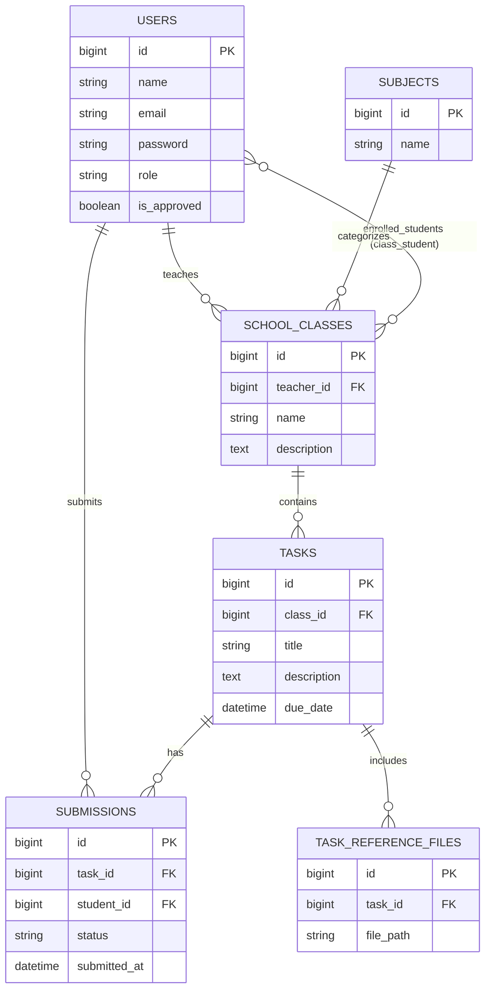

# Assignment Submission Application

A modern Laravel-based web application designed for educational institutions to streamline the assignment submission process. The platform provides dedicated portals for both teachers and students to manage classes, tasks, and submissions efficiently.

## 🚀 Features

### For Teachers
- **Class Management**: Create and manage classes, and add students to specific rosters.
- **Task Creation**: Assign tasks to classes with descriptions, due dates, and reference materials.
- **Submission Review**: View all student submissions, download files, and mark them as checked.
- **Dashboard**: Overview of classes and recent student activities.
- **Calendar**: Visualized deadlines and task schedules.

### For Students
- **Class Enrollment**: Access all classes they are enrolled in.
- **Task Submission**: Submit assignments with file upload support (PDF, Excel, Docx, JSON).
- **Progress Tracking**: Monitor submission status and view feedback.
- **Dashboard**: Quick view of pending tasks and recent updates.
- **Calendar**: Keep track of upcoming deadlines in a calendar format.

## 🛠️ Setup Instructions

### Prerequisites
- PHP 8.3+
- Composer
- Node.js & NPM
- SQLite (or another supported database)

### Installation Steps
1. **Clone the repository:**
   ```bash
   git clone <repository-url>
   cd assignment-system
   ```

2. **Install dependencies:**
   ```bash
   composer install
   npm install
   ```

3. **Environment Setup:**
   ```bash
   cp .env.example .env
   php artisan key:generate
   ```

4. **Database Configuration:**
   Create a database (e.g., `database/database.sqlite`) and update your `.env` file:
   ```env
   DB_CONNECTION=sqlite
   DB_DATABASE=C:\Users\nikon\Desktop\assignment-system\database\database.sqlite
   ```

5. **Run Migrations & Seeders:**
   ```bash
   php artisan migrate --seed
   ```

6. **Build Assets & Start Server:**
   ```bash
   npm run dev
   # In another terminal
   php artisan serve
   ```

## 📊 Database Schema (ERD)



## 👥 Group Members

- **Member 1 Name** - [Role/ID]
- **Member 2 Name** - [Role/ID]
- **Member 3 Name** - [Role/ID]
- **Member 4 Name** - [Role/ID]

---
*Built with ❤️ using Laravel & TailwindCSS.*
